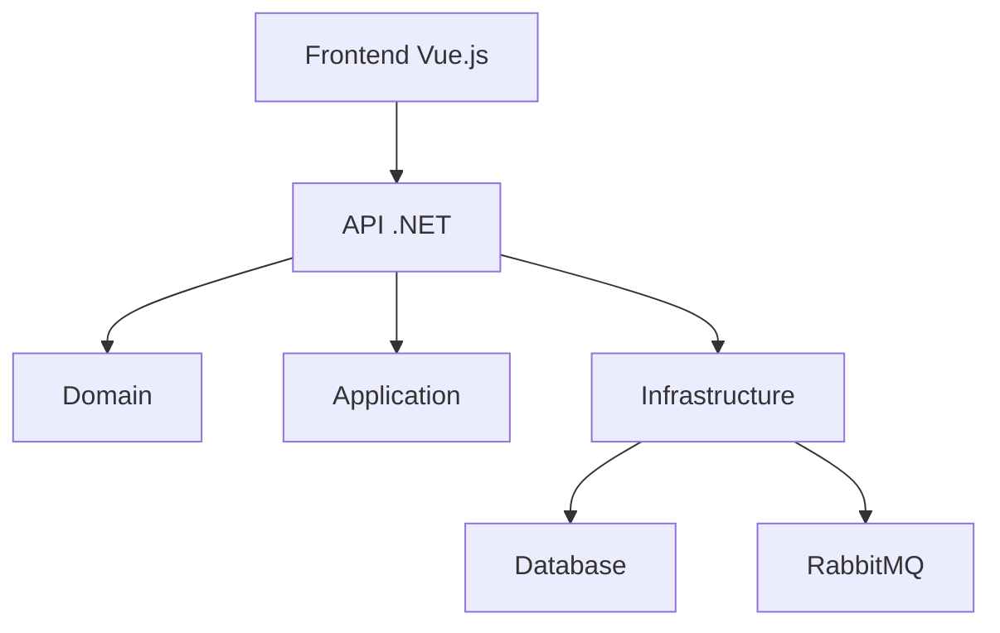

# TesteVsoft - Sistema de Gerenciamento de Tarefas

## Descrição do Projeto
Sistema completo para gerenciamento de tarefas com autenticação de usuários, notificações e integração com calendários.

## Arquitetura
O projeto segue uma arquitetura limpa (Clean Architecture) com as seguintes camadas:

- **TesteVsoft.Domain**: Contém as entidades e regras de negócio
- **TesteVsoft.Application**: Lógica de aplicação e casos de uso
- **TesteVsoft.Infrastructure**: Implementação de repositórios, serviços e infraestrutura
- **TesteVsoft.ApiService**: API REST com endpoints
- **TesteVsoft.Frontend**: Interface web em Vue.js

## Tecnologias Utilizadas

### Backend
- .NET 8
- Entity Framework Core
- RabbitMQ para mensageria
- NUnit para testes

### Frontend
- Vue.js 3
- Pinia para gerenciamento de estado
- Tailwind CSS

## Funcionalidades
- CRUD de tarefas
- Autenticação de usuários
- Notificações via email
- Geração de arquivos iCalendar
- Criação em massa de usuários

## Como Executar

1. Pré-requisitos:
   - Docker
   - .NET 8 SDK
   - Node.js

**Configurações de E-mail e SMTP:**
Antes de rodar o projeto, certifique-se de preencher suas informações de e-mail e SMTP no arquivo `TesteVsoft.ApiService/appsettings.json`.

2. Comandos:
```bash
dotnet run --project TesteVsoft.AppHost/TesteVsoft.AppHost.csproj
```

Após a execução, o dashboard do Aspire estará disponível em: <mcurl name="https://localhost:17126/" url="https://localhost:17126/"></mcurl>

**Credenciais de Acesso (Frontend):**
Para o primeiro acesso ao frontend, utilize as seguintes credenciais:
- **Usuário:** `admin`
- **Senha:** `vsoft`

### Migrações
Para adicionar uma nova migração, execute o script PowerShell:
./Docs/add-migration.ps1 -MigrationName "NomeDaSuaMigracao"

## Testes
```bash
# Unitários
cd TesteVsoft.Application.Tests && dotnet test

# Relatório de Cobertura de Código
Para gerar o relatório de cobertura de código, execute o script PowerShell:
./Docs/code-coverage.ps1

O relatório gerado estará disponível em: `./Docs/TestResults/index.html`
```

## Bônus
Integração com calendários (Outlook, Thunderbird) via arquivos .ics

## Diagrama de Arquitetura
